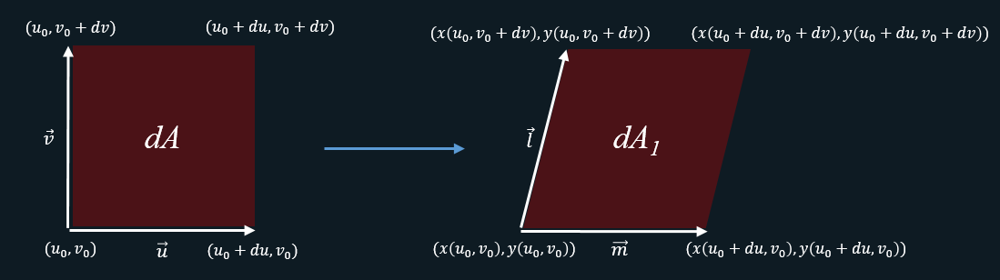

### 积的导数
$$
\begin{aligned}
[u(x)v(x)]^{'} &= \lim\limits_{\varDelta x \to 0} \frac {u(x+\varDelta x)v(x+\varDelta x) - u(x)v(x)} {\varDelta x} \\
&= \lim\limits_{\varDelta x \to 0} \frac {u(x+\varDelta x)v(x+\varDelta x) - u(x+\varDelta x)v(x) + u(x+\varDelta x)v(x) - u(x)v(x)} {\varDelta x} \\
&= \lim\limits_{\varDelta x \to 0} \frac {u(x+\varDelta x)v(x+\varDelta x) - u(x+\varDelta x)v(x)} {\varDelta x} +
\lim\limits_{\varDelta x \to 0} \frac {u(x+\varDelta x)v(x) - u(x)v(x)} {\varDelta x} \\
&= \lim\limits_{\varDelta x \to 0} \frac {v(x+\varDelta x) - v(x)} {\varDelta x} u(x+\varDelta x) +
\lim\limits_{\varDelta x \to 0} \frac {u(x+\varDelta x) - u(x)} {\varDelta x} v(x) \\
&= v^{'}(x)u(x) + u^{'}(x)v(x)
\end{aligned}
$$

### 分部积分
根据积的导数可知，两边同时积分接的分部积分的结论。

$$
\int u(x)v^{'}(x)dx = u(x)v(x) - \int u^{'}(x)v(x)dx
$$

### 二重积分换元
对二重积分来说，换元其实就是底面积的变化，要想换元前后$(u,v) \rightarrow (x(u,v), y(u, v))$的结果不变，需要保证换元前后底面积不变。

根据上图可得：

$$
\begin{aligned}
\overrightarrow m &= (x(u_0+du, v_0) - x(u_0, v_0), y(u_0+du, v_0) - y(u_0, v_0)) \\
&= x_u^{'}du + y_u^{'}du
\end{aligned}
$$

$$
\begin{aligned}
\overrightarrow l &= (x(v_0+dv, u_0) - x(u_0, v_0), y(v_0+dv, u_0) - y(u_0, v_0)) \\
&= x_v^{'}dv + y_v^{'}dv
\end{aligned}
$$

进一步可得：

$$
\begin{aligned}
|\overrightarrow u \times \overrightarrow v| &= dudv =dA_1=dA_2=dxdy=
|\overrightarrow m \times \overrightarrow l| \\
&=|x_u^{'}y_v^{'}-y_u^{'}x_v^{'}|dudv =
\begin{vmatrix}
x_u^{'} & x_v^{'} \\ 
y_u^{'} & y_v^{'}
\end{vmatrix} dudv \\
&= |J|dudv
\end{aligned}
$$

### 迹(Trace)的性质
对于两个尺寸相同的矩阵$A_{m \times n},B_{m \times n}$，有如下性质：

$$
\begin{aligned}
tr(A^TB) &=
\begin{bmatrix}
 a_{11} & a_{21} & a_{31} & \cdots & a_{m1} \\
 a_{12} & a_{22} & a_{32} & \cdots & a_{m2} \\
 a_{13} & a_{23} & a_{33} & \cdots & a_{m3} \\
 \vdots & \vdots & \vdots & \cdots & \vdots \\
 a_{1n} & a_{2n} & a_{3n} & \cdots & a_{mn}
\end{bmatrix}_{n \times m}
\begin{bmatrix}
 b_{11} & b_{12} & b_{13} & \cdots & b_{1n} \\
 b_{21} & b_{22} & b_{23} & \cdots & b_{2n} \\
 b_{31} & b_{32} & b_{33} & \cdots & b_{3n} \\
 \vdots & \vdots & \vdots & \cdots & \vdots \\
 b_{m1} & b_{m2} & b_{m3} & \cdots & b_{mn}
\end{bmatrix}_{m \times n} \\
&=
\begin{bmatrix}
 \sum_{i=1}^ma_{i1}b_{i1} & \cdot & \cdot & \cdots & \cdot \\
 \cdot & \sum_{i=1}^ma_{i2}b_{i2} & \cdot & \cdots & \cdot \\
 \cdot & \cdot & \sum_{i=1}^ma_{i3}b_{i3} & \cdots & \cdot \\
 \vdots & \vdots & \vdots & \cdots & \vdots \\
 \cdot & \cdot & \cdot & \cdots & \sum_{i=1}^ma_{in}b_{in}
\end{bmatrix}_{n \times n} \\
&= {\sum}_{i,j}A_{i,j}B_{i,j} = A_{m \times n} \odot B_{m \times n} = tr(B^TA)
\end{aligned}
$$

其中 $\odot$ 表示逐元素点成。进一步可得迹的循环等价结论：

$$
tr(ABC)=tr(A(BC))=tr((BC)A)=tr(BCA)=tr(CAB)
$$

其中 $A_{m \times n},B_{n \times m},C_{m \times m}$。

### 标量对矩阵的导数
$$
df = \sum_{i=0}^m \sum_{j=0}^n \frac {\partial f} {\partial X_{ij}} dX_{ij}
= \frac {\partial f} {\partial X} \odot dX = tr({\frac {\partial f} {\partial X}}^T dX)
$$
