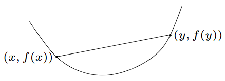

### 信息熵(Information Entropy)
信息论中，某个信息$x_i$出现的不确定性的大小定义为$x_i$所携带的信息量，用$I(x_i)$表示：

$$
I(x_i) = log \frac {1} {p(x_i)} = -log(p(x_i))
$$

进一步可得平均信息量为：

$$
H(x)
=-\sum_x{p(x) log(p(x))}
=-\sum_{i=1}^{n}{p(x_i) log(p(x_i))}
$$

由于$H(x)$与热力学中熵的定义类似，故又称为**信息熵**。

### 交叉熵(Cross Entropy)

$$
H(p, q)
=-\sum_x{p(x) log(q(x))}
=-\sum_{i=1}^{n}{p(x_i) log(q(x_i))}
$$

### 凸函数(Convex Function)
如果对于函数$f(x)$域中任意$x,y,0 \le \theta \le 1$满足：

$$
f(\theta x + (1-\theta)y) \le \theta f(x) + (1-\theta) f(y)
$$

此类函数就叫凸函数。更一般的结论是：若$f(x)$区间$[a,b]$下的凸函数，则对任意$x_1,x_2,x_3,...,x_n \in [a,b]$，且$a_1+a_2+a_3+...+a_n=1$，$a_1,a_2,a_3,...,a_n$为正数，有：

$$
f(a_1x_1+a_2x_2+a_3x_3+...+a_nx_n) \le a_1f(x_1)+a_2f(x_2)+a_3f(x_3)+...+a_nf(x_n)
$$

当且仅当$x_1=x_2=x_3=...=x_n$时等号成立

### 詹森不等式(Jensen Inequality)
根据凸函数一般结论中权重部分的定义，显然概率密度函数也是符合要求的。假设$\varphi[g(x)]$是一个符合要求的凸函数，再结合概率密度函数，则有：

$$
\varphi \bigg( \int_{-\infty}^{+\infty} g(x)f(x)dx \bigg) \le \int_{-\infty}^{+\infty} \varphi [g(x)]f(x)dx
$$

如果假设$g(x)=x$，则上式可简化为：

$$
\varphi \bigg( \int_{-\infty}^{+\infty} xf(x)dx \bigg) \le \int_{-\infty}^{+\infty} \varphi (x)f(x)dx
$$

定义$X$为随机变量，根据概率论中对期望的定义，则有：

$$
\varphi (E[X]) \le E[\varphi (X)]
$$

对于詹森不等式，一种朴素的理解：对于凸函数，任意两点的连线在函数曲线之上，则对函数值的加权平均仍然在这条直线上，即大于函数曲线上的值的；而如果先对两点之间的坐标值加权平均之后再求函数值，那么这个值必定在直线之下；简而言之，对点坐标对应的函数值的加权平均大于等于先对坐标加权平均后再求得的函数值。

### 相对熵(Relative entropy) or KL散度(Kullback-Leibler Divergence)
$p(x)$是目标分布，$q(x)$是模型预测分布

$$
D_{KL}(p \parallel q)=KL[p(x) \parallel q(x)]
={\sum}_{x \in X} p(x) log \frac {p(x)} {q(x)}
=E_{x \in p(x)}[log \frac {p(x)} {q(x)}]
$$

性质：
- 当两个分布$p(x)$和$q(x)$相同时，$D_{KL}(p \parallel q)=0$
- 非对称性：$D_{KL}(p \parallel q) \neq D_{KL}(q \parallel p)$
- 非负性：$D_{KL}(p \parallel q) \ge 0$

$$
\begin{aligned}
D_{KL}(p \parallel q)
&=\sum_x p(x) log \frac {p(x)} {q(x)} \\
&=-\sum_x p(x) log \frac {q(x)} {p(x)} \\
&=-E_{p(x)}\Bigg[ log \frac {q(x)} {p(x)} \Bigg] \\
&\ge -log E_{p(x)}\Bigg[\frac {q(x)} {p(x)} \Bigg] \\
&=-log \sum_x p(x) \frac {q(x)} {p(x)} \\
&=-log \sum_x {q(x)} \\
&=-log(1) = 0
\end{aligned}
$$

#### 两个高斯分布的KL散度
设$log(\cdot)=ln(\cdot)$，且$p(x)$、$q(x)$的概率密度函数分别为：

$$p(x) = \frac {1} {\sqrt{2 \pi \sigma_1^2}} e^{-\frac {(x-\mu_1)^2} {2 \sigma_1^2}}$$

$$q(x) = \frac {1} {\sqrt{2 \pi \sigma_2^2}} e^{-\frac {(x-\mu_2)^2} {2 \sigma_2^2}}$$

带入$D_{KL}(p \parallel q)$可得：

$$
\begin{aligned}
D_{KL}(p \parallel q) &= \int_{-\infty}^{+\infty} p(x) log \frac {p(x)} {q(x)} \\
&=\int_{-\infty}^{+\infty} p(x) \bigg[
    \frac {(x-\mu_2)^2} {2 \sigma_2^2} -
    \frac {(x-\mu_1)^2} {2 \sigma_1^2} +
    log \bigg( \frac {\sigma_2} {\sigma_1} \bigg)
\bigg] \\
&= log \bigg( \frac {\sigma_2} {\sigma_1} \bigg)
+ \int_{-\infty}^{+\infty} p(x)\frac {(x-\mu_2)^2} {2 \sigma_2^2}dx
- \int_{-\infty}^{+\infty} p(x)\frac {(x-\mu_1)^2} {2 \sigma_1^2}dx 
\end{aligned}
$$

其中

$$
\begin{aligned}
\int_{-\infty}^{+\infty} p(x)\frac {(x-\mu_1)^2} {2 \sigma_1^2}dx &= \int_{-\infty}^{+\infty} \frac {(x-\mu_1)^2} {2 \sigma_1^2} \frac {1} {\sqrt{2 \pi \sigma_1^2}} e^{-\frac {(x-\mu_1)^2} {2 \sigma_1^2}}dx \\
&= \frac {1} {2\sigma_1^3\sqrt{2\pi}} \int_{-\infty}^{+\infty} (x_1-\mu_1)^2e^{-\frac {(x-\mu_1)^2} {2 \sigma_1^2}}dx \\
&= \frac {1} {2\sigma_1^3\sqrt{2\pi}} \int_{-\infty}^{+\infty} y^2e^{-\frac {y^2} {2 \sigma_1^2}}dy \\
&= \frac {1} {2\sigma_1^3\sqrt{2\pi}} \times \frac {(\sqrt{2}\sigma_1)^3} {2} \sqrt{\pi} \\
&= \frac {1} {2}
\end{aligned}
$$

另外

$$
\begin{aligned}
\int_{-\infty}^{+\infty} p(x)\frac {(x-\mu_2)^2} {2 \sigma_2^2}dx
&= \frac {1} {2\sigma_2^2} \int_{-\infty}^{+\infty} p(x)(x^2-2x\mu_2+\mu_2^2-2x\mu_1+\mu_1^2+2x\mu_1-\mu_1^2)dx \\
&= \frac {1} {2\sigma_2^2} \int_{-\infty}^{+\infty} p(x)\bigg[(x-\mu_1)^2+2x(\mu_1-\mu_2)+(\mu_2^2-\mu_1^2) \bigg]dx \\
&= \frac {1} {2\sigma_2^2}\bigg[\int_{-\infty}^{+\infty} p(x)(x-\mu_1)^2dx + 2(\mu_1-\mu_2)\int_{-\infty}^{+\infty} xp(x)dx
+ (\mu_2^2-\mu_1^2) \int_{-\infty}^{+\infty} p(x)dx \bigg] \\
&= \frac {1} {2\sigma_2^2}\bigg[D[x]
+ 2(\mu_1-\mu_2)E[x] + (\mu_2^2-\mu_1^2) \bigg] \\
&= \frac {1} {2\sigma_2^2}\bigg[\sigma_1^2 + 2\mu_1^2 - 2\mu_1\mu_2 + \mu_2^2 - \mu_1^2  \bigg] \\
&= \frac {\sigma_1^2 + (\mu_1-\mu_2)^2} {2\sigma_2^2}
\end{aligned}
$$

带入可得：

$$
D_{KL}(p \parallel q)
= log \bigg( \frac {\sigma_2} {\sigma_1} \bigg)
+ \frac {\sigma_1^2 + (\mu_1-\mu_2)^2} {2\sigma_2^2}
- \frac {1} {2} 
$$

#### 多元高斯分布的KL散度
定义两个多元正态分布：

$$
\begin{split}
P: \; x &\sim \mathcal{N}(\mu_1, \Sigma_1) \\
Q: \; x &\sim \mathcal{N}(\mu_2, \Sigma_2) \;
\end{split}
$$

根据概率论中对方差的定义可得：

$$
\begin{aligned}
D(X) &= E[(X-E(X))(X-E(X))^T] = E[XX^T - E(X)X^T - XE^T(X) + E(X)E^T(X)] \\
&= E[XX^T] - E(X)E(X^T) - E(X)E^T(X) + E(X)E^T(X) \\
&= E[XX^T] - E(X)E(X^T)
\end{aligned}
$$

由此可得：

$$E[XX^T] = D(X) + E(X)E(X^T) = \Sigma + \mu\mu^T$$

进一步计算KL散度为：

$$
\begin{aligned}
\mathrm{KL}[P \parallel Q] &= \int_{\mathcal{X}} p(x) \, \ln \frac{p(x)}{q(x)} \mathrm{d}x \\
 &= \int_{\mathbb{R}^n} \mathcal{N}(x; \mu_1, \Sigma_1) \, \ln \frac{\mathcal{N}(x; \mu_1, \Sigma_1)}{\mathcal{N}(x; \mu_2, \Sigma_2)} \, \mathrm{d}x \\
&= \left< \ln \frac{\mathcal{N}(x; \mu_1, \Sigma_1)}{\mathcal{N}(x; \mu_2, \Sigma_2)} \right>_{p(x)} \\
&= \left< \ln \frac{ \frac{1}{\sqrt{(2 \pi)^n |\Sigma_1|}} \cdot \exp \left[ -\frac{1}{2} (x-\mu_1)^\mathrm{T} \Sigma_1^{-1} (x-\mu_1) \right] }{ \frac{1}{\sqrt{(2 \pi)^n |\Sigma_2|}} \cdot \exp \left[ -\frac{1}{2} (x-\mu_2)^\mathrm{T} \Sigma_2^{-1} (x-\mu_2) \right] } \right>_{p(x)} \\
&= \left<\frac{1}{2} \ln \frac{|\Sigma_2|}{|\Sigma_1|} - \frac{1}{2} (x-\mu_1)^\mathrm{T} \Sigma_1^{-1} (x-\mu_1) + \frac{1}{2} (x-\mu_2)^\mathrm{T} \Sigma_2^{-1} (x-\mu_2) \right>_{p(x)} \\
&= \frac{1}{2} \left< \ln \frac{|\Sigma_2|}{|\Sigma_1|} - (x-\mu_1)^\mathrm{T} \Sigma_1^{-1} (x-\mu_1) + (x-\mu_2)^\mathrm{T} \Sigma_2^{-1} (x-\mu_2) \right>_{p(x)} \\
&= \frac{1}{2} \left< \ln \frac{|\Sigma_2|}{|\Sigma_1|} - \mathrm{tr}\left[ \Sigma_1^{-1} (x-\mu_1) (x-\mu_1)^\mathrm{T} \right] + \mathrm{tr}\left[ \Sigma_2^{-1} (x-\mu_2) (x-\mu_2)^\mathrm{T} \right] \right>_{p(x)} \\
&= \frac{1}{2} \left< \ln \frac{|\Sigma_2|}{|\Sigma_1|} - \mathrm{tr}\left[ \Sigma_1^{-1} (x-\mu_1) (x-\mu_1)^\mathrm{T} \right] + \mathrm{tr}\left[ \Sigma_2^{-1} \left( x x^\mathrm{T} - 2 \mu_2 x^\mathrm{T} + \mu_2 \mu_2^\mathrm{T} \right) \right] \right>_{p(x)} \\
&= \frac{1}{2} \left( \ln \frac{|\Sigma_2|}{|\Sigma_1|} - \mathrm{tr}\left[ \Sigma_1^{-1} \left< (x-\mu_1) (x-\mu_1)^\mathrm{T} \right>_{p(x)} \right] + \mathrm{tr}\left[ \Sigma_2^{-1} \left< x x^\mathrm{T} - 2 \mu_2 x^\mathrm{T} + \mu_2 \mu_2^\mathrm{T} \right>_{p(x)} \right] \right) \\
&= \frac{1}{2} \left( \ln \frac{|\Sigma_2|}{|\Sigma_1|} - \mathrm{tr}\left[ \Sigma_1^{-1} \left< (x-\mu_1) (x-\mu_1)^\mathrm{T} \right>_{p(x)} \right] + \mathrm{tr}\left[ \Sigma_2^{-1} \left( \left< x x^\mathrm{T} \right>_{p(x)} - \left< 2 \mu_2 x^\mathrm{T} \right>_{p(x)} + \left< \mu_2 \mu_2^\mathrm{T} \right>_{p(x)} \right) \right] \right) \\
&= \frac{1}{2} \left( \ln \frac{|\Sigma_2|}{|\Sigma_1|} - \mathrm{tr}\left[ \Sigma_1^{-1} \Sigma_1 \right] + \mathrm{tr}\left[ \Sigma_2^{-1} \left( \Sigma_1 + \mu_1 \mu_1^\mathrm{T} - 2 \mu_2 \mu_1^\mathrm{T} + \mu_2 \mu_2^\mathrm{T} \right) \right] \right) \\
&= \frac{1}{2} \left( \ln \frac{|\Sigma_2|}{|\Sigma_1|} - \mathrm{tr}\left[ I_n \right] + \mathrm{tr}\left[ \Sigma_2^{-1} \Sigma_1 \right] + \mathrm{tr}\left[ \Sigma_2^{-1} \left( \mu_1 \mu_1^\mathrm{T} - 2 \mu_2 \mu_1^\mathrm{T} + \mu_2 \mu_2^\mathrm{T} \right) \right] \right) \\
&= \frac{1}{2} \left( \ln \frac{|\Sigma_2|}{|\Sigma_1|} - n + \mathrm{tr}\left[ \Sigma_2^{-1} \Sigma_1 \right] + \mathrm{tr}\left[ \mu_1^\mathrm{T} \Sigma_2^{-1} \mu_1  - 2 \mu_1^\mathrm{T} \Sigma_2^{-1} \mu_2  + \mu_2^\mathrm{T} \Sigma_2^{-1} \mu_2 \right] \right) \\
&= \frac{1}{2} \left[ \ln \frac{|\Sigma_2|}{|\Sigma_1|} - n + \mathrm{tr}\left[ \Sigma_2^{-1} \Sigma_1 \right] + (\mu_2 - \mu_1)^\mathrm{T} \Sigma_2^{-1} (\mu_2 - \mu_1) \right]
\end{aligned}
$$

最后，整理可得：

$$
\mathrm{KL}[P \parallel Q] = \frac{1}{2} \left[ (\mu_2 - \mu_1)^\mathrm{T} \Sigma_2^{-1} (\mu_2 - \mu_1) + \mathrm{tr}(\Sigma_2^{-1} \Sigma_1) - \ln \frac{|\Sigma_1|}{|\Sigma_2|} - n \right]
$$

> [Proof: Kullback-Leibler divergence for the multivariate normal distribution](https://statproofbook.github.io/P/mvn-kl.html)