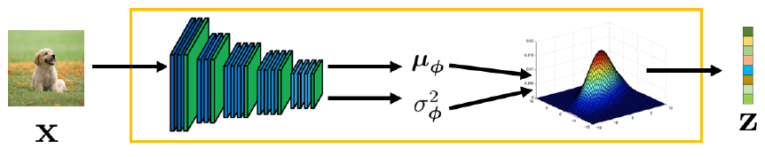

### ELBO
$$
\begin{aligned}
\mathrm{log}p(x) &= \mathrm{log}p(x) \int q_{\phi}(z|x)dz \\
&= \int q_{\phi}(z|x)(\mathrm{log}p(x))dz \\
&= E_{q_{\phi}(z|x)}[\mathrm{log}p(x)] \\
&= E_{q_{\phi}(z|x)} \bigg[ \mathrm{log} \frac {p(x, z)} {p(z|x)} \bigg] \\
&= E_{q_{\phi}(z|x)} \bigg[ \mathrm{log} \frac {p(x, z)q_{\phi}(z|x)} {p(z|x)q_{\phi}(z|x)} \bigg] \\
&= E_{q_{\phi}(z|x)} \bigg[ \mathrm{log} \frac {p(x, z)} {q_{\phi}(z|x)} \bigg] +
E_{q_{\phi}(z|x)} \bigg[ \mathrm{log} \frac {q_{\phi}(z|x)} {p(z|x)} \bigg] \\
&= E_{q_{\phi}(z|x)} \bigg[ \mathrm{log} \frac {p(x, z)} {q_{\phi}(z|x)} \bigg] +
D_{KL}(q_{\phi}(z|x) \parallel p(z|x)) \\
&\ge \underbrace{E_{q_{\phi}(z|x)} \bigg[ \mathrm{log} \frac {p(x, z)} {q_{\phi}(z|x)} \bigg]}_{ELBO}
\end{aligned}
$$

ELBO还可再进一步分解：

$$
\begin{aligned}
ELBO & \overset{\mathrm{def}}{=} E_{q_{\phi}(z|x)} \bigg[ \mathrm{log} \frac {p(x, z)} {q_{\phi}(z|x)} \bigg] = E_{q_{\phi}(z|x)} \bigg[ \mathrm{log} \frac {p_{\theta}(x|z)p(z)} {q_{\phi}(z|x)} \bigg] \\
&= E_{q_{\phi}(z|x)} [\mathrm{log}p_{\theta}(x|z)] + E_{q_{\phi}(z|x)} \bigg[ \mathrm{log} \frac {p(z)} {q_{\phi}(z|x)} \bigg] \\
&= \underbrace{E_{q_{\phi}(z|x)} [\mathrm{log}p_{\theta}(x|z)]}_{reconstruction \ term} - \underbrace{D_{KL}(q_{\phi}(z|x) \parallel p(z))}_{prior\ matching\ term}
\end{aligned}
$$

### VAE
定义编码器和先验分布均为高斯分布，具体如下：

$$
q_{\phi}(z|x) = \mathcal{N} (z;\bm{\mu}_{\phi}(x), \bm{\sigma}_{\phi}^2(x)\bm{I}) \\
p(z) = \mathcal{N} (z; \bm{0}, \bm{I})
$$

因此，$ELBO$中$KL$散度项有解析值，而重建损失项可以通过蒙特卡罗估计来近似计算，进一步可得：

$$
\begin{aligned}
\underset{\phi,\theta} {\mathrm{arg\ max}}\ E_{q_{\phi}(z|x)} [\mathrm{\mathrm{log}}p_{\theta}(x|z)] - D_{KL}(q_{\phi}(z|x) \parallel p(z)) \approx \underset{\phi,\theta} {\mathrm{arg\ max}} \sum_{l=1}^{L}\mathrm{\mathrm{log}}p_{\theta}(x|z^{(l)}) - D_{KL}(q_{\phi}(z|x) \parallel p(z))
\end{aligned}
$$

由于$\left \{ z^{(l)} \right \}_{l=1}^{L}$是从每个样本$x$对应的分布$q_{\phi}(z|x)$中随机采样得到的，而随机采样不具有可导性，因此没法优化模型。而使用重参数化技术(reparameterization
trick)可以解决该问题，因为对于任意的正态分布，我们都可以通过标准正态分布变换得到：

$$
z = \mu + \sigma \epsilon \quad \mathrm{with} \; \epsilon \sim \mathcal{N}(\epsilon;0,I)
$$

因此，在VAE中，$z$就可以表示成一个关于数据样本$x$和辅助噪声变量$\epsilon$的确定性函数：

$$
z = \mu_{\phi}(x) + \sigma_{\phi}(x) \epsilon \quad \mathrm{with} \; \epsilon \sim \mathcal{N}(\epsilon;0,I)
$$

此时，梯度可以回传到编码器$\phi$中，进而优化$\mu_{\phi}$和$\sigma_{\phi}$，最终通过蒙特卡罗估计和重参数化优化基于$\phi$和$\theta$的$ELBO$。
